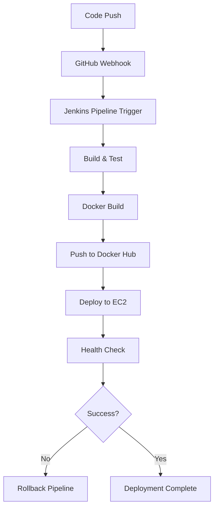

# Automated Jenkins EC2 Deployment with Terraform

A comprehensive Infrastructure as Code (IaC) solution that provisions an AWS EC2 instance and bootstraps Jenkins with complete automation, including GitHub webhook integration, Docker Hub credentials, and automated pipeline creation using Jenkins Configuration as Code (JCasC).

## 🚀 Overview

**Automated Jenkins EC2 Deployment with Terraform** provisions an AWS EC2 instance and bootstraps Jenkins via a user-data script, enabling consistent, version-controlled CI/CD infrastructure. This approach accelerates onboarding, reduces manual configuration errors, and ensures reproducible environments across teams.

### Key Features

- **🏗️ Complete Infrastructure Automation:** EC2, VPC, Security Groups, and networking
- **🔧 Jenkins Configuration as Code (JCasC):** Automated plugin installation and configuration
- **🔗 GitHub Integration:** Automated webhook management with dynamic IP updates
- **🐳 Docker Hub Integration:** Secure credential management and container registry setup
- **🎨 User Experience:** Dark theme and admin user configuration
- **📦 Pipeline Automation:** Pre-configured deployment and rollback pipelines
- **🛡️ Security:** Proper credential handling and network security

## 📋 Prerequisites

Before you begin, ensure you have:

- **AWS Account** with permissions to create:
  - EC2 instances, VPCs, security groups
  - IAM roles and key pairs
  - S3 buckets (for state management - optional)
- **Terraform v1.5 or later** installed and on your PATH
- **Git client** (e.g., Git for Windows, macOS Command Line Tools, or Git on Linux)
- **AWS EC2 SSH key pair** (public key uploaded to EC2 Key Pairs)
- **GitHub Personal Access Token** with webhook management permissions
- **Docker Hub account** and access token
- **(Optional)** AWS CLI configured (`aws configure`)

## 📁 Repository Structure

```
.
├── main.tf                   # Main Terraform resources and GitHub webhook automation
├── provider.tf              # Terraform provider and AWS region configuration
├── security_group.tf        # Security group with ports 22, 80, 3000, 8080
├── variables.tf             # All input variables including GitHub and Docker Hub
├── outputs.tf               # Jenkins URL, IPs, and admin credentials
├── terraform.tfvars         # Variable values (sensitive data - not in repo)
├── jenkins_bootstrap.sh     # Comprehensive Jenkins setup with JCasC
├── .gitignore              # Terraform state and sensitive files
└── README.md               # Project documentation
```

## 🛠️ Setup Instructions

### 1. Clone the Repository

```bash
git clone https://github.com/BhaktaBhusanDas/JenkinsSetupUsingTerraform.git
cd JenkinsSetupUsingTerraform
```

### 2. Configure Variables

Create `terraform.tfvars` in the project root with all required values:

```hcl
# Jenkins Configuration
jenkins_admin_username = "JenkinsAdmin"
jenkins_admin_password = "your-secure-password"
environment = "production"

# AWS Configuration
key_name = "your-ec2-key-pair-name"

# Docker Hub Integration
dockerhub_username = "your-dockerhub-username"
dockerhub_password = "your-dockerhub-access-token"

# GitHub Integration (for webhook automation)
github_token = "ghp_your-github-personal-access-token"
github_owner = "your-github-username"
github_repo = "target-repository-name"
github_webhook_id = "your-webhook-id"
```

**⚠️ Security Note:** Never commit `terraform.tfvars` to version control. It's already included in `.gitignore`.

### 3. Initialize and Deploy

```bash
# Initialize Terraform
terraform init

# Validate configuration
terraform validate

# Preview deployment plan
terraform plan

# Apply configuration
terraform apply
```

Type `yes` when prompted. Terraform will:
1. Provision EC2 instance with security groups
2. Execute `jenkins_bootstrap.sh` to install and configure Jenkins
3. Set up GitHub webhook with the new EC2 public IP
4. Configure Docker Hub credentials in Jenkins

### 4. Access Jenkins

After completion, Terraform outputs will display:

```bash
jenkins_url = "http://YOUR-EC2-IP:8080"
jenkins_public_ip = "YOUR-EC2-IP"
```

Navigate to the Jenkins URL and log in with your configured admin credentials.

## 🔧 Advanced Configuration

### GitHub Webhook Integration

The infrastructure automatically manages GitHub webhooks for seamless CI/CD:

**Automated Features:**
- **Dynamic IP Updates:** Webhook URL automatically updated when EC2 IP changes
- **API Integration:** Uses GitHub REST API with personal access token
- **PowerShell Automation:** Cross-platform webhook management script

**How it works:**
1. `null_resource.update_github_webhook` triggers on IP changes
2. PowerShell script calls GitHub API to update webhook configuration
3. New webhook URL: `http://NEW-EC2-IP:8080/github-webhook/`

**Required GitHub Token Permissions:**
- `repo` (full repository access)
- `admin:repo_hook` (manage webhooks)

### Docker Hub Integration

Automated Docker Hub credential setup for container registry operations:

**Features:**
- **Secure Credential Storage:** Credentials stored in Jenkins credential store
- **Automated Setup:** No manual credential configuration required
- **Environment Variable Support:** Sensitive data passed via Terraform variables
- **Pipeline Ready:** Credentials available as `docker-hub-creds` in Jenkins

**Credential Configuration:**
```groovy
// Automatically created in Jenkins
credentialId: 'docker-hub-creds'
description: 'Docker Hub credentials for pushing images'
username: 'your-dockerhub-username'
password: 'your-dockerhub-access-token'
```

### Jenkins Configuration as Code (JCasC)

Complete automation of Jenkins setup without manual intervention:

**Automated Configurations:**
- **Plugin Installation:** 20+ essential plugins including Docker, GitHub, Pipeline
- **Security Setup:** Admin user creation, CSRF protection, security realm
- **Theme Configuration:** Dark theme enabled by default
- **Pipeline Creation:** Automated job creation for deployment and rollback

**Pre-installed Plugins:**
```yaml
Essential Plugins:
- cloudbees-folder, build-timeout, credentials-binding
- workflow-aggregator, github-branch-source, pipeline-github-lib
- git, docker-workflow, blueocean, dark-theme
- nodejs, configuration-as-code, job-dsl
```

**Automated Pipeline Jobs:**

1. **Application Deployment Pipeline:**
   - Triggered by GitHub webhooks
   - Builds, tests, and deploys Node.js application
   - Automatic Docker image creation and push

2. **rollback-deployment:**
   - Parameterized rollback capabilities
   - Quick version switching
   - Container management and health checks

## 🛡️ Security Configuration

### Network Security

Security group configuration for controlled access:

```hcl
Allowed Inbound Ports:
- 22 (SSH): Server administration
- 80 (HTTP): Web traffic
- 8080 (Jenkins): Jenkins web interface
- 3000 (App): Application access
```

### Credential Management

**Secure Handling:**
- All sensitive data passed via environment variables
- Terraform sensitive variables for password protection
- Jenkins credential store for Docker Hub integration
- GitHub token for API authentication

**Security Best Practices:**
- EC2 instance with proper IAM roles
- Security groups with minimal required access
- Encrypted credential storage in Jenkins
- No hardcoded secrets in configuration files

## 📊 Infrastructure Components

### AWS Resources Created

| Resource | Description | Configuration |
|----------|-------------|---------------|
| **EC2 Instance** | Jenkins server | t2.micro, Amazon Linux 2, 20GB storage |
| **Security Group** | Network access control | Ports 22, 80, 3000, 8080 |
| **Null Resource** | GitHub webhook automation | PowerShell script for API calls |

### System Requirements

**EC2 Instance Specifications:**
- **Instance Type:** t2.micro (suitable for development/testing)
- **Operating System:** Amazon Linux 2
- **Storage:** 20GB GP3 EBS volume
- **Memory Enhancement:** 4GB swap file for improved performance
- **Network:** Public IP with security group protection

## 🔄 CI/CD Workflow Integration

This infrastructure seamlessly integrates with application repositories:



## 🚀 Quick Start Example

```bash
# Complete deployment in under 10 minutes
git clone https://github.com/BhaktaBhusanDas/JenkinsSetupUsingTerraform.git
cd JenkinsSetupUsingTerraform

# Configure your variables (create terraform.tfvars)
terraform init
terraform apply -auto-approve

# Access Jenkins at the provided URL
# GitHub webhook automatically configured
# Docker Hub credentials ready for use
```

## 📈 Monitoring and Troubleshooting

### Health Checks

### Common Issues and Solutions

**Jenkins Not Starting:**
```bash
# Check service status
sudo systemctl status jenkins

# View detailed logs
sudo journalctl -u jenkins -f

# Check bootstrap logs
tail -f /var/log/jenkins-bootstrap.log
```

**GitHub Webhook Issues:**
```bash
# Verify GitHub token permissions
# Check webhook configuration in GitHub repository
# Review Terraform apply logs for webhook update errors
```

**Docker Issues:**
```bash
# Verify Docker installation
docker --version

# Check Jenkins Docker permissions
sudo usermod -aG docker jenkins
sudo systemctl restart jenkins
```

## 🔄 Maintenance and Updates

### Updating Infrastructure

```bash
# Update Terraform configuration
terraform plan
terraform apply

# Webhook automatically updated on IP change
```

### Adding New Features

1. **Modify Configuration:** Update `jenkins_bootstrap.sh` or Terraform files
2. **Test Changes:** Use `terraform plan` to preview changes
3. **Apply Updates:** Run `terraform apply` to implement changes
4. **Verify Integration:** Check Jenkins and application functionality

## 📝 Environment Variables Reference

### Required Variables

| Variable | Description | Example |
|----------|-------------|---------|
| `jenkins_admin_username` | Jenkins admin username | `"JenkinsAdmin"` |
| `jenkins_admin_password` | Jenkins admin password | `"secure-password"` |
| `key_name` | AWS EC2 key pair name | `"my-key-pair"` |
| `dockerhub_username` | Docker Hub username | `"username"` |
| `dockerhub_password` | Docker Hub access token | `"dckr_pat_..."` |
| `github_token` | GitHub personal access token | `"ghp_..."` |
| `github_owner` | GitHub repository owner | `"username"` |
| `github_repo` | Target repository name | `"hello-node-docker"` |
| `github_webhook_id` | GitHub webhook ID | `"564183434"` |

### Optional Variables

| Variable | Description | Default |
|----------|-------------|---------|
| `environment` | Environment name | `"dev"` |
| `aws_region` | AWS region | `"us-east-1"` |

## 🔗 Integration Examples

### Application Repository Integration

This infrastructure works with application repositories like [hello-node-docker](https://github.com/BhaktaBhusanDas/hello-node-docker):

**Automatic Integration Features:**
- Pipeline jobs created automatically
- GitHub webhooks configured for the application repository
- Docker Hub credentials available for image pushes
- Rollback pipelines ready for quick version management

### Multi-Environment Setup

Deploy multiple environments using different variable files:

```bash
# Development environment
terraform apply -var-file="dev.tfvars"

# Production environment  
terraform apply -var-file="prod.tfvars"
```

## 🤝 Contributing

1. Fork the repository
2. Create a feature branch: `git checkout -b feature-name`
3. Test your changes thoroughly
4. Commit changes: `git commit -am 'Add feature'`
5. Push to branch: `git push origin feature-name`
6. Submit a pull request

## 📄 License

This project is open source and available under the MIT License.

## 👨‍💻 Author

**Bhakta Bhusan Das**
- GitHub: [@BhaktaBhusanDas](https://github.com/BhaktaBhusanDas)
- LinkedIn: [Connect with me](https://linkedin.com/in/bhaktabhusandas)

---

## 🔗 Related Projects

- **[Hello Node Docker Application](https://github.com/BhaktaBhusanDas/hello-node-docker)** - Sample Node.js application with automated CI/CD integration

## 📚 Additional Resources

- [Terraform AWS Provider Documentation](https://registry.terraform.io/providers/hashicorp/aws/latest/docs)
- [Jenkins Configuration as Code](https://www.jenkins.io/projects/jcasc/)
- [GitHub Webhook Documentation](https://docs.github.com/en/developers/webhooks-and-events/webhooks)
- [Docker Hub API Documentation](https://docs.docker.com/docker-hub/api/latest/)

---

**⭐ If this project helped you, please star the repository to show your support!**
